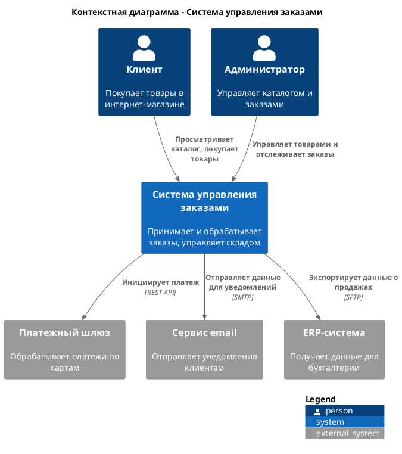

### **Инструкция по созданию контекстной диаграммы (C4 Level 1) в PlantUML**

# **1. Концепция и цель**
**Контекстная диаграмма (Context Diagram)** — это диаграмма самого высокого уровня (Level 1) в нотации C4. Она показывает систему в качестве целого блока и её взаимодействие с внешним миром.

*   **Аудитория:** Все стейкхолдеры, включая нетехнических (бизнес-заказчики, менеджеры).
*   **Цель:** Ответить на вопросы: *"Что делает система?"*, *"Кто её использует?"*, *"С какими внешними системами она взаимодействует?"*
*   **Ключевые элементы:** Система, люди/роли (акторы), внешние системы.
Запрет на указание используемых технологий: Перед проектированием диаграмм необходимо уточнить у пользователя стек используемых на проекте технологий, если пользователь не сможет указать стек то исключить указание стека технологий на диаграммах всех уровней C4

В случае если файл с диаграммой существует, необходимо спросить пользователя нужно ли обновить текущий файл, либо нужно сохранить диаграмму в файл со следующей версией.
# **2. Базовый синтаксис PlantUML для C4**

Для использования нотации C4 в PlantUML необходимо подключить соответствующую библиотеку.

**Обязательная строка в начале скрипта:**
```plantuml
@startuml
!include <C4/C4_Context>
' Ваш код диаграммы здесь...
@enduml
```

# **3. Основные элементы и их объявление**

### **3.1. Система (System)**
Центральный элемент диаграммы, который мы проектируем.

```
System(alias, "label", "optional description")
```
*   `alias` - уникальный идентификатор элемента (латиница, без пробелов).
*   `label` - отображаемое имя системы.
*   `description` - необязательное краткое описание назначения системы.

**Пример:**
```plantuml
System(system_a, "Система управления заказами", "Обрабатывает заказы клиентов, управляет складом и доставкой")
```

### **3.2. Акторы (People/Person)**
Люди или роли, которые взаимодействуют с системой.

```
Person(alias, "label", "optional description")
```
*   `alias` - уникальный идентификатор.
*   `label` - отображаемое имя роли/человека.

**Пример:**
```plantuml
Person(customer, "Клиент", "Покупатель товаров в интернет-магазине")
Person(admin, "Администратор", "Управляет товарами и отслеживает заказы")
```

### **3.3. Внешние системы (External Systems)**
Программные системы, которые находятся вне зоны контроля вашей команды, но с которыми ваша система взаимодействует.

```
System_Ext(alias, "label", "optional description")
```
*   `alias` - уникальный идентификатор.
*   `label` - отображаемое имя внешней системы.

**Пример:**
```plantuml
System_Ext(payment_gateway, "Платежный шлюз", "Обрабатывает платежи по кредитным картам")
System_Ext(email_service, "Сервис email-уведомлений", "Отправляет письма клиентам")
```

### **3.4. Связи (Relationships)**
Показывают взаимодействие между элементами. Указывают характер взаимодействия.

**Синтаксис:**
```
Rel(from, to, "label", "technology")
```
*   `from`, `to` - alias элементов, связанных стрелкой.
*   `label` - описание взаимодействия (например, "Покупает товары", "Получает уведомления").
*   `technology` - необязательное указание технологии/протокола (например, "Web UI", "REST API"). *На контекстной диаграмме часто опускается.*

**Пример:**
```plantuml
Rel(customer, system_a, "Покупает товары", "Web UI")
Rel(system_a, payment_gateway, "Инициирует платеж", "REST API")
Rel(system_a, email_service, "Отправляет данные для уведомления", "SMTP")
Rel(admin, system_a, "Управляет товарами", "Web UI")
```

# **4. Группировка элементов (Boundaries)**
Для визуального выделения внутренней и внешней среды можно использовать границы.

```
Enterprise_Boundary(alias, "label") {
    ' Элементы внутри границы предприятия
}
```

**Пример:**
```plantuml
Enterprise_Boundary(enterprise_a, "Наша компания") {
    Person(admin, "Администратор")
    System(system_a, "Система управления заказами")
}
Enterprise_Boundary(enterprise_b, "Партнер") {
    System_Ext(payment_gateway, "Платежный шлюз")
}
```

# **5. Легенда (Legend)**
Для официальной документации рекомендуется добавлять легенду.

```
SHOW_LEGEND()
```

# **6. Полный пример диаграммы**



# **7. Чек-лист качества диаграммы**
Перед сохранением проверьте диаграмму:
1.  [ ] **Включена директива** `!include <C4/C4_Context>`
2.  [ ] **Есть понятный заголовок** (`Title`).
3.  [ ] **Центральная система** только одна (та, которую вы проектируете).
4.  [ ] **Показаны все ключевые пользователи** (акторы) и **внешние системы**.
5.  [ ] **Связи** подписаны понятным бизнес-языком (что делают, а не как технически реализовано).
6.  [ ] **Отсутствуют технические детали** внутреннего устройства системы (это задача диаграммы контейнеров).
7.  [ ] **Алиасы** элементов уникальны и написаны латиницей.
8.  [ ] **Легенда** (`SHOW_LEGEND()`) добавлена для официальных артефактов.
9.  [ ] **После сохранения файла** Спроси у пользователя какие еще документы необходимо сгенерировать либо скорректировать, предоставив ему список.
**Формат имени файла:** `c4_Level_1_context_diagram_[НазваниеПроекта]_v[номер версии (начиная с 1)].plantuml` 


##МЕТРИКИ КАЧЕСТВА
1. Полнота:
   * Все ключевые акторы присутствуют
   * Основные интеграции отражены
2. Согласованность:
   * Имена соответствуют другим артефактам
   * Нет противоречий с реальностью
3. Актуальность:
   * Указана версия диаграммы
   * Есть дата последнего обновления


###ИНТЕГРАЦИЯ С ДРУГИМИ АРТЕФАКТАМИ
1. С User Story:
   * Акторы должны быть согласованы
   * Основные сценарии отражены
2. С Component Diagram:
   * Внешние системы дублируются
   * Уровень детализации согласован
3. С ERD:
   * Внешние БД соответствуют сущностям