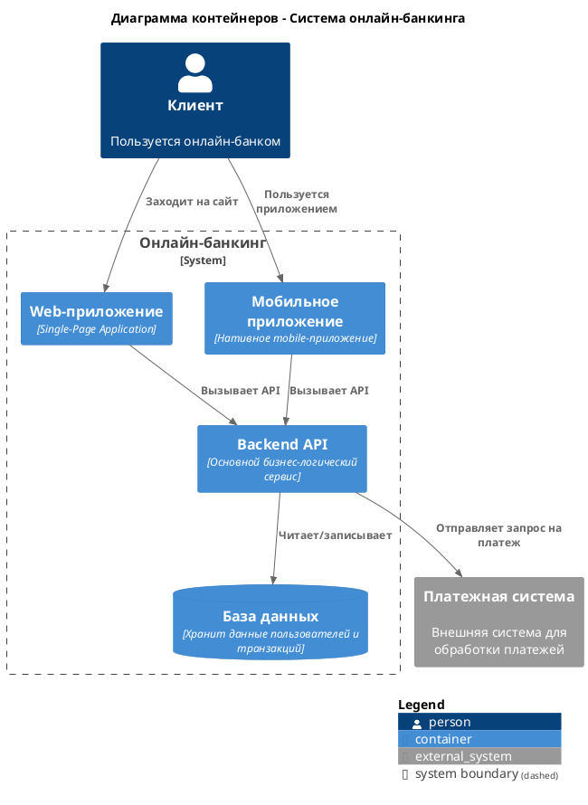

### **Инструкция по созданию диаграмм контейнеров (C4 Level 2) в PlantUML**

# **1. Концепция и цель**
**Диаграмма контейнеров (Container Diagram)** — это диаграмма второго уровня в нотации C4. Она детализирует **систему** (из контекстной диаграммы), показывая из каких крупных исполняемых единиц (контейнеров) она состоит и как они взаимодействуют.

*   **Аудитория:** Разработчики, DevOps-инженеры, архитекторы.
*   **Цель:** Ответить на вопросы: *"Как система работает под капотом?"*, *"Из каких крупных компонентов состоит?"*, *"Как они общаются?"*.
*   **Ключевые элементы:** Контейнеры (приложения, БД), отношения между ними и ключевые технологии.

Запрет на указание используемых технологий: Перед проектированием диаграмм необходимо уточнить у пользователя стек используемых на проекте технологий, если пользователь не сможет указать стек то исключить указание стека технологий на диаграммах всех уровней C4

В случае если файл с диаграммой существует, необходимо спросить пользователя нужно ли обновить текущий файл, либо нужно сохранить диаграмму в файл со следующей версией.
# **2. Базовый синтаксис PlantUML для C4**

Для использования нотации C4 в PlantUML необходимо подключить соответствующую библиотеку.
Диаграмма должна соответсвовать синтаксису, указанному в https://github.com/plantuml-stdlib/C4-PlantUML

**Обязательная строка в начале скрипта:**
```plantuml
@startuml
!include <C4/C4_Container>
' Ваш код диаграммы здесь...
@enduml
```

# **3. Основные элементы и их объявление**

### **3.1. Система (Уточнение контекста)**
Элемент верхнего уровня, который мы детализируем.

```
System(alias, "label", "optional description")
```
*   `alias` - уникальный идентификатор элемента (латиница, без пробелов).
*   `label` - отображаемое имя.
*   `description` - необязательное описание.

**Пример:**
```plantuml
System(online_banking, "Онлайн-банкинг", "Предоставляет клиентам доступ к их счетам и операциям через web и mobile")
```

### **3.2. Контейнеры (Containers)**
Основные строительные блоки диаграммы. Это запускаемые процессы/приложения или хранилища данных.

**Синтаксис объявления:**
```
Container(alias, "label", "technology", "optional description")
```
*   `technology` - указание технологии (например, "React", "Spring Boot", "PostgreSQL").

**Типы контейнеров:**
*   `Container()` - универсальный контейнер (приложение, сервис).
*   `ContainerDb()` - контейнер для базы данных.
*   `ContainerQueue()` - контейнер для очереди сообщений (брокера).
*   `Container_Ext()` - внешний контейнер (управляемый третьей стороной).

**Примеры:**
```plantuml
Container(spa, "Web-приложение", "Single-Page Application для клиентов")
ContainerDb(db, "База данных", "Хранит все финансовые данные и логины пользователей")
Container(backend_api, "Backend API", "Предоставляет REST API для web и mobile клиентов")
Container_Ext(email_service, "Сервис email", "Внешний сервис для отправки уведомлений")
```

### **3.3. Связи (Relationships)**
Показывают взаимодействие между контейнерами. Указывают протокол или технологию взаимодействия.

**Синтаксис:**
```
Rel(from, to, "label", "technology")
```
*   `from`, `to` - alias элементов, связанных стрелкой.
*   `label` - описание взаимодействия (например, "Читает/Записывает").
*   `technology` - технология/протокол (например, "REST API", "JDBC", "Kafka").

**Пример:**
```plantuml
Rel(spa, backend_api, "Вызывает API")
Rel(backend_api, db, "Читает/записывает")
Rel(backend_api, email_service, "Отправляет уведомления")
```

# **4. Группировка и границы (Boundaries)**
Для визуального выделения частей системы, принадлежащих разным доменам или командам, используйте границы.

**Синтаксис:**
```
Boundary(alias, "label") {
    container1 = Container(...)
    container2 = Container(...)
    Rel(container1, container2, ...)
}
```

**Пример:**
```plantuml
Boundary(boundary_backend, "Backend домен") {
    Container(api_gateway, "API Gateway")
    Container(user_service, "User Service")
    Container(account_service, "Account Service")
    Rel(api_gateway, user_service, "Вызывает")
    Rel(api_gateway, account_service, "Вызывает")
}
```

# **5. Легенда (Legend)**
Для официальной документации рекомендуется добавлять легенду, объясняющую элементы диаграммы.

```
SHOW_LEGEND()
```

# **6. Полный пример диаграммы**



# **7. Чек-лист качества диаграммы**
Перед сохранением проверьте диаграмму:
1.  [ ] **Включена директива** `!include <C4/C4_Container>`
2.  [ ] **Роли** Все роли пользователей, указанные в других файлах, должны быть учтены на данной диаграмме.
3.  [ ] **Есть понятный заголовок** (`Title`).
4.  [ ] **Все контейнеры** Не имеют указание технологии.
5.  [ ] **Все связи** подписаны (какое действие выполняется без указания протокола).
6.  [ ] **Отсутствуют лишние детали** (не нужно показывать все микросервисы, если их десятки).
7.  [ ] **Алиасы** элементов уникальны и написаны латиницей.
8.  [ ] **Легенда** (`SHOW_LEGEND()`) добавлена для официальных артефактов.
9.  [ ] **В случае микросервисной архитектуры:** Дле сервиса недопустимо создание более двух БД одного типа.
10. [ ] **Запрет на указание используемых технологий:** Перед проектированием диаграмм необходимо уточнить у пользователя стек используемых на проекте технологий, если пользователь не сможет указать стек то исмключить указание стека технологий на диаграммах всех уровней C4.
11. [ ] **Проверка ролей пользователей** На диаграмме должны быть указаны все роли пользователей, которые есть на контекстной диаграмме (C4 Level 1).
12. [ ] **По окончанию выполнения** Спроси у пользователя какие еще документы необходимо сгенерировать либо скорректировать, предоставив ему список.

**Формат имени файла:** `c4_Level_2_containers_diagram_[НазваниеПроекта]_v[номер версии (начиная с 1)].plantuml`