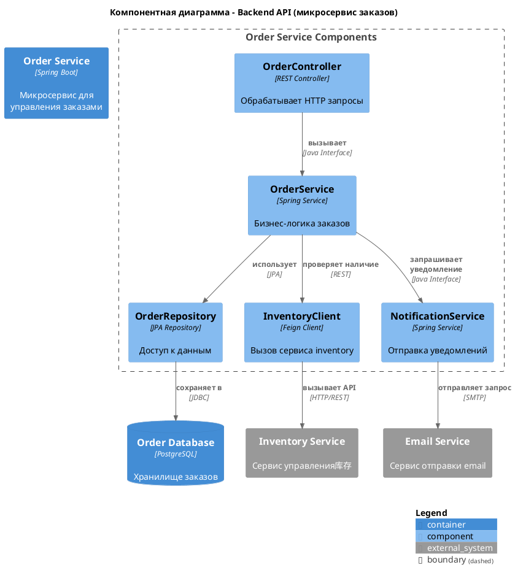

### **Инструкция по созданию компонентной диаграммы (C4 Level 3) в PlantUML**

# **1. Концепция и цель**
**Компонентная диаграмма (Component Diagram)** — это диаграмма третьего уровня в нотации C4. Она детализирует каждый из **контейнеров** (из диаграммы контейнеров), показывая из каких логических компонентов (модулей, сервисов) он состоит и как они взаимодействуют внутри него.

В случае, когда просят нарисовать компонентную диаграмму необходимо запросить у пользователя для всех ли контейнеров необходимы компонентные диаграммы (дав ему возможность выбора).

Запрет на указание используемых технологий: Перед проектированием диаграмм необходимо уточнить у пользователя стек используемых на проекте технологий, если пользователь не сможет указать стек то исключить указание стека технологий на диаграммах всех уровней C4

*   **Аудитория:** Разработчики, архитекторы.
*   **Цель:** Ответить на вопросы: *"Как устроен контейнер изнутри?"*, *"Из каких компонентов он состоит?"*, *"Как эти компоненты взаимодействуют между собой?"*
*   **Ключевые элементы:** Компоненты, интерфейсы (API), отношения между ними.
*   
В случае если файл с диаграммой существует, необходимо спросить пользователя нужно ли обновить текущий файл, либо нужно сохранить диаграмму в файл со следующей версией.

Во ремя создания диаграммы применять принцип KISS (Keep It Simple, Stupid или Keep It Short and Simple) - это фундаментальный принцип проектирования и разработки, согласно которому большинство систем работают лучше всего, когда они остаются простыми, а не усложняются излишне


# **2. Базовый синтаксис PlantUML для C4**

Для использования нотации C4 в PlantUML необходимо подключить соответствующую библиотеку.
Диаграмма должна соответсвовать синтаксису, указанному в https://github.com/plantuml-stdlib/C4-PlantUML


Спросить у пользователя, для каких контейнеров необходимо нарисовать компонентную диаграмму взяв спико контейнеров из диаграммы контейнеров (если она создана), если не создана то создать ее.


**Обязательная строка в начале скрипта:**
```plantuml
@startuml
!include <C4/C4_Component>
' Ваш код диаграммы здесь...
@enduml
```

# **3. Основные элементы и их объявление**

### **3.1. Контейнер (Container)**
Элемент верхнего уровня, который мы детализируем. Он должен быть объявлен на диаграмме контейнеров.

```
Container(alias, "label", "technology", "optional description")
```

### **3.2. Компоненты (Components)**
Основные строительные блоки диаграммы. Это логически сгруппированные модули, сервисы или библиотеки внутри контейнера.

**Синтаксис объявления:**
```
Component(alias, "label", "technology", "optional description")
```
*   `alias` - уникальный идентификатор элемента (латиница, без пробелов).
*   `label` - отображаемое имя компонента.
*   `technology` - указание технологии (например, "Java Class", "REST Controller", "Spring Service").
*   `description` - необязательное описание ответственности компонента.

**Пример:**
```plantuml
Component(controller, "OrderController", "Spring REST Controller", "Обрабатывает HTTP запросы, связанные с заказами")
Component(service, "OrderService", "Spring Service", "Инкапсулирует бизнес-логику работы с заказами")
Component(repository, "OrderRepository", "JPA Repository", "Обеспечивает персистентность данных заказа")
```

### **3.3. Интерфейсы (Interfaces)**
Показывают, как компоненты предоставляют функциональность друг другу или внешнему миру (например, API).

**Синтаксис:**
```
Rel_U(to, from, "interface label", "technology")
```
*   `to`, `from` - alias элементов, связанных стрелкой.
*   `interface label` - название интерфейса/API (например, "getOrderById").
*   `technology` - технология/протокол (например, "REST", "Java Interface").

**Пример:**
```plantuml
Rel_U(controller, service, "Order API", "Java Interface")
```

### **3.4. Связи (Relationships)**
Показывают взаимодействие между компонентами. Указывают характер взаимодействия.

**Синтаксис:**
```
Rel(from, to, "label", "technology")
```
*   `from`, `to` - alias элементов, связанных стрелкой.
*   `label` - описание взаимодействия (например, "вызывает", "использует").
*   `technology` - технология/протокол (например, "method call", "REST").

**Пример:**
```plantuml
Rel(service, repository, "использует", "JPA")
```

### **3.5. Базы данных и внешние зависимости**
Для показа взаимодействия с БД или внешними сервисами внутри контейнера.

```
ContainerDb(alias, "label", "technology", "optional description")
```

**Пример:**
```plantuml
ContainerDb(database, "Orders Database", "PostgreSQL", "Хранит данные заказов")
```

# **4. Группировка компонентов**
Для визуальной организации компонентов по ответственностям или слоям.

```
Boundary(alias, "label") {
    Component(component1, "Component1")
    Component(component2, "Component2")
}
```

**Пример:**
```plantuml
Boundary(web_layer, "Web Layer") {
    Component(controller, "OrderController")
}
Boundary(service_layer, "Service Layer") {
    Component(service, "OrderService")
}
Boundary(persistence_layer, "Persistence Layer") {
    Component(repository, "OrderRepository")
}
```

# **5. Легенда (Legend)**
Для официальной документации рекомендуется добавлять легенду.

```
SHOW_LEGEND()
```

# **6. Полный пример диаграммы**



# **7. Чек-лист качества диаграммы**
Перед сохранением проверьте диаграмму:
1.  [ ] **Включена директива** `!include <C4/C4_Component>`
2.  [ ] **Есть понятный заголовок** (`Title`) с указанием детализируемого контейнера.
3.  [ ] **Все связи** подписаны (какое действие выполняется).
4.  [ ] **Показаны ключевые интерфейсы** между компонентами.
5.  [ ] **Отсутствуют излишние детали** (не нужно показывать все методы и классы).
6.  [ ] **Алиасы** элементов уникальны и написаны латиницей с расшифровкой на русском в скобках.
7.  [ ] **Легенда** (`SHOW_LEGEND()`) добавлена для официальных артефактов.
8.  [ ] **Синтаксис** Качество диграмм PlantUML в нотации C4: Диаграммы должны не противоречить сиснтаксису, указанному в https://github.com/plantuml-stdlib/C4-PlantUML
9.  [ ] Спросить у пользователя, для каких еще контейнеров необходимо нарисовать компонентную диаграмму
10. [ ] **По окончанию выполнения** Спроси у пользователя какие еще документы необходимо сгенерировать либо скорректировать, предоставив ему список.

**Формат имени файла:** `c4_Level_3_component_diagram_[НазваниеПроекта]_([НазваниеКонтейнера])_v[номер версии (начиная с 1)].plantuml`

