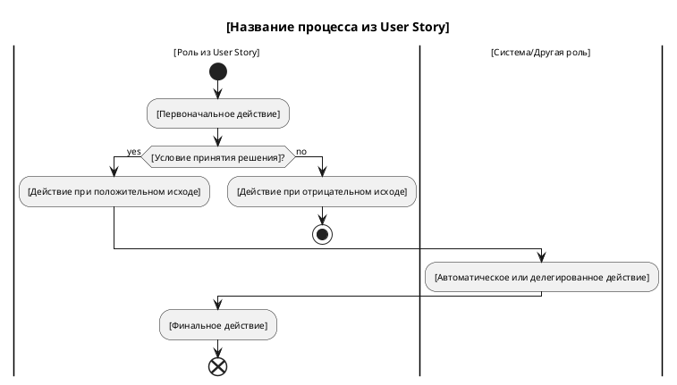

# Инструкции по созданию Activity диаграмм для ИИ агента

## Содержание
1. [Основы и требования](#основы-и-требования)
2. [Структура диаграммы](#структура-диаграммы)
3. [Метрики качества](#метрики-качества)
4. [Валидационные правила](#валидационные-правила)
5. [Базовый шаблон](#базовый-шаблон)
6. [Элементы диаграммы](#элементы-диаграммы)
7. [Управляющие конструкции](#управляющие-конструкции)
8. [Обработка параллельности](#обработка-параллельности)
9. [Интеграция с артефактами](#интеграция-с-артефактами)
10. [Стандартные паттерны](#стандартные-паттерны)
11. [Чек-лист качества](#чек-лист-качества)

---

## Основы и требования

### Обязательные входные артефакты:
- **User Story** - для понимания бизнес-цели и границ процесса
- **Use Case** - для детального описания потока действий
- **Business Process Description** - для понимания логики и правил

### Дополнительные артефакты:
- Техническая спецификация, Business Rules, Workflow documentation
- Sequence диаграммы для понимания взаимодействий

### Цель Activity Diagram:
- Моделирование потока действий и принятия решений
- Визуализация параллельных процессов и синхронизации
- Демонстрация логики бизнес-процесса от начала до конца
- Выявление точек принятия решений и альтернативных путей

---

## Структура диаграммы

### 1. Заголовок и настройки


### 2. Swimlanes (дорожки ответственности)
```plantuml
|Роль 1|
start
:Действие 1;

|Роль 2|
:Действие 2;

|Система|
:Автоматическое действие;
```

### 3. Структурная организация
- **Начало**: обязательная стартовая точка
- **Действия**: описание конкретных шагов
- **Решения**: точки ветвления логики
- **Параллельность**: fork/join для concurrent действий
- **Завершение**: end или stop

---

## Метрики качества

### Целевые показатели:
- **Покрытие потока**: 100% шагов из Use Case представлены
- **Логическая группировка**: использование swimlanes для ролей
- **Детализация решений**: каждое if имеет все возможные выходы
- **Параллельность**: выявлены и смоделированы concurrent процессы
- **Обработка ошибок**: минимум 2 error handling потока

### Система оценки:
- **Отличное качество**: ≥90% соответствие метрикам + полное покрытие Use Case
- **Хорошее качество**: 70-89% соответствие метрикам
- **Требует доработки**: <70% соответствие метрикам

### Конкретные метрики:
- Количество swimlanes: 2-6 (по ролям из Use Case)
- Количество решений: 1-5 на каждые 10 действий
- Глубина вложенности: не более 3 уровней
- Parallel flows: выявлены все возможные параллельные процессы

---

## Валидационные правила

### Автоматические проверки:
```
✓ Начинается с @startuml, заканчивается @enduml
✓ Имеется единственная точка start
✓ Все пути приводят к end/stop
✓ Каждое if имеет соответствующие then/else ветки
✓ Все fork имеют соответствующие join
✓ Swimlanes соответствуют ролям из Use Case
✓ Действия содержат активные глаголы
✓ Нет "висящих" действий без входа/выхода
✓ Решения формулированы в виде вопросов
```

### Семантические проверки:
```
✓ Каждое действие соответствует шагу из Use Case
✓ Последовательность действий логически связана
✓ Роли в swimlanes соответствуют акторам из User Story
✓ Все альтернативные потоки из Use Case представлены
✓ Error handling покрывает основные исключения
```

---

## Базовый шаблон



---

## Элементы диаграммы

### Основные элементы:

#### 1. Начало и конец
```plantuml
start                    // Единственная точка входа
end                      // Нормальное завершение
stop                     // Аварийное завершение
kill                     // Принудительное завершение
detach                   // Асинхронное завершение
```

#### 2. Действия (Activities)
```plantuml
:Действие с активным глаголом;
:Проверить корректность данных;
:Отправить уведомление;
:[Действие в квадратных скобках для системы];
```

**Правила именования действий:**
- Начинать с активного глагола в инфинитиве
- Быть конкретными и измеримыми
- Избегать технических деталей, фокус на бизнес-логике
- Длина: 2-6 слов

#### 3. Решения (Decision Points)
```plantuml
if (Данные корректны?) then (yes)
  :Продолжить обработку;
else (no)
  :Вернуть ошибку валидации;
  stop
endif

// Множественные варианты
switch (Тип пользователя?)
case (Admin)
  :Показать админ панель;
case (User)
  :Показать пользовательский интерфейс;
case (Guest)
  :Показать гостевую страницу;
endswitch
```

#### 4. Параллельная обработка
```plantuml
fork
  :Отправить email;
fork again
  :Отправить SMS;
fork again
  :Записать в аудит;
end fork

// С синхронизацией
fork
  :Обработать платеж;
fork again
  :Зарезервировать товар;
end merge  // Ждем завершения всех веток
```

#### 5. Петли и повторения
```plantuml
// Простая петля
repeat
  :Получить следующий элемент;
  :Обработать элемент;
repeat while (Есть еще элементы?)

// Цикл while
while (Условие продолжения?)
  :Выполнить действие;
endwhile

// Цикл for
repeat :i = 1;
  :Обработать элемент i;
  :i = i + 1;
repeat while (i <= количество?)
```

---

## Управляющие конструкции

### 1. Простое ветвление
```plantuml
if (Пользователь авторизован?) then (yes)
  :Показать персональные данные;
else (no)
  :Перенаправить на страницу входа;
  stop
endif
```

### 2. Множественное ветвление
```plantuml
switch (Статус заказа?)
case (Новый)
  :Отправить в обработку;
case (В обработке)
  :Продолжить обработку;
case (Выполнен)
  :Отправить клиенту;
case (Отменен)
  :Вернуть средства;
  stop
endswitch
```

### 3. Вложенные условия
```plantuml
if (Пользователь авторизован?) then (yes)
  if (Есть права администратора?) then (yes)
    :Показать админ функции;
  else (no)
    :Показать обычный интерфейс;
  endif
else (no)
  :Показать форму входа;
endif
```

### 4. Обработка исключений
```plantuml
:Попытаться выполнить операцию;
note right: Может возникнуть ошибка

if (Операция успешна?) then (yes)
  :Продолжить выполнение;
else (no)
  if (Критическая ошибка?) then (yes)
    :Записать в лог ошибок;
    :Уведомить администратора;
    stop
  else (no)
    :Показать сообщение пользователю;
    :Предложить повторить;
  endif
endif
```

---

## Обработка параллельности

### 1. Независимые параллельные процессы
```plantuml
fork
  :Отправить email уведомление;
fork again
  :Отправить push уведомление;
fork again
  :Записать в аудит лог;
end fork

:Продолжить основной процесс;
```

### 2. Синхронизированные процессы
```plantuml
fork
  :Проверить наличие товара;
fork again
  :Проверить лимит кредита;
fork again
  :Проверить адрес доставки;
end merge

if (Все проверки пройдены?) then (yes)
  :Создать заказ;
else (no)
  :Отклонить заказ;
  stop
endif
```

### 3. Условная параллельность
```plantuml
if (Требуется срочная доставка?) then (yes)
  fork
    :Зарезервировать товар;
  fork again
    :Найти ближайший склад;
  fork again
    :Подготовить курьера;
  end merge
else (no)
  :Обычная обработка заказа;
endif
```

---

## Интеграция с артефактами

### Связь с User Story:
- **Роли в swimlanes** = роли из "As a [role]"
- **Основной поток** = реализация "I want to [action]"
- **Результат диаграммы** = достижение "So that [benefit]"

### Связь с Use Case:
- **Главный поток UC** = основная последовательность action'ов
- **Альтернативные потоки UC** = else/case ветки
- **Исключения UC** = error handling блоки
- **Предусловия UC** = условия в начале диаграммы
- **Постусловия UC** = состояния в end точках

### Связь с Business Rules:
- **Правила принятия решений** = условия в if/switch
- **Бизнес-ограничения** = validation блоки
- **Approval процессы** = последовательности в соответствующих swimlanes

### Связь с техническими артефактами:
- **API спецификация** = автоматизированные действия
- **Database схема** = data persistence действия
- **Sequence диаграммы** = детализация взаимодействий между swimlanes

---

## Стандартные паттерны

### 1. Паттерн "Запрос-Обработка-Ответ"
```plantuml
|Пользователь|
start
:Отправить запрос;

|Система|
:Получить запрос;
:Валидировать данные;

if (Данные корректны?) then (yes)
  :Обработать запрос;
  :Сформировать ответ;
else (no)
  :Сформировать ошибку;
endif

|Пользователь|
:Получить ответ;
end
```

### 2. Паттерн "Approval Workflow"
```plantuml
|Инициатор|
start
:Создать заявку;

|Менеджер|
:Рассмотреть заявку;

if (Одобрить?) then (yes)
  if (Сумма > лимит?) then (yes)
    |Директор|
    :Финальное одобрение;
    
    if (Одобрить?) then (yes)
      |Система|
      :Выполнить операцию;
    else (no)
      :Отклонить;
      stop
    endif
  else (no)
    |Система|
    :Выполнить операцию;
  endif
else (no)
  :Отклонить;
  stop
endif

|Инициатор|
:Получить уведомление;
end
```

### 3. Паттерн "Batch Processing"
```plantuml
|Система|
start
:Получить список элементов;

repeat
  :Взять следующий элемент;
  
  fork
    :Обработать элемент;
  fork again
    :Записать прогресс;
  end fork
  
repeat while (Есть необработанные элементы?)

:Сформировать отчет;
:Отправить уведомление о завершении;
end
```

### 4. Паттерн "Error Recovery"
```plantuml
|Система|
start
:retry_count = 0;

repeat
  :Попытаться выполнить операцию;
  
  if (Операция успешна?) then (yes)
    :Зафиксировать результат;
    end
  else (no)
    :retry_count++;
    
    if (retry_count < max_retries?) then (yes)
      :Подождать интервал;
    else (no)
      :Записать в лог критической ошибки;
      :Уведомить администратора;
      stop
    endif
  endif
repeat while (retry_count < max_retries?)
```

---

## Swimlanes и роли

### Правила использования swimlanes:
1. **Одна swimlane = одна роль/система**
2. **Максимум 6 swimlanes** (для читаемости)
3. **Роли берутся из User Story и Use Case**
4. **Системы выделяются отдельно от человеческих ролей**

### Стандартные swimlanes:
```plantuml
|Пользователь|        // Основная роль из User Story
|Система|             // Автоматизированные процессы
|Администратор|       // Управленческие действия
|Внешняя система|     // Интеграции
|База данных|         // Только для сложных процессов
```

### Переходы между swimlanes:
- Передача управления = переход к действию в другой swimlane
- Параллельная работа = fork с действиями в разных swimlanes
- Синхронизация = merge действий из разных swimlanes

---

## Типичные ошибки и как их избегать

### 1. Слишком техническая детализация
❌ **Неправильно:**
```plantuml
:Выполнить SQL SELECT запрос к таблице users;
:Десериализовать JSON ответ;
:Обновить Redux store;
```

✅ **Правильно:**
```plantuml
:Получить данные пользователя;
:Обработать полученную информацию;
:Обновить отображение;
```

### 2. Смешивание уровней абстракции
❌ **Неправильно:**
```plantuml
:Нажать кнопку "Отправить";
:Валидировать email адрес;
:Отправить HTTP POST запрос;
:Показать сообщение об успехе;
```

✅ **Правильно:**
```plantuml
:Инициировать отправку формы;
:Проверить корректность данных;
:Передать данные в систему;
:Уведомить о результате;
```

### 3. Отсутствие обработки ошибок
❌ **Неправильно:**
```plantuml
:Отправить запрос;
:Получить ответ;
:Показать результат;
```

✅ **Правильно:**
```plantuml
:Отправить запрос;

if (Запрос выполнен успешно?) then (yes)
  :Показать результат;
else (no)
  :Показать сообщение об ошибке;
endif
```

### 4. Неправильное использование параллельности
❌ **Неправильно:** (последовательные действия как параллельные)
```plantuml
fork
  :Авторизоваться;
fork again
  :Получить данные профиля;
end fork
```

✅ **Правильно:**
```plantuml
:Авторизоваться;

fork
  :Отправить welcome email;
fork again
  :Записать событие в аудит;
end fork

:Перенаправить на главную;
```

---

## Специальные элементы

### 1. Заметки и комментарии
```plantuml
:Выполнить сложную операцию;
note right
  Эта операция может занять
  до 30 секунд
end note

:Другое действие;
note left: Быстрая операция
```

### 2. Связанные подпроцессы
```plantuml
:Инициировать процесс одобрения;
note right: См. отдельную диаграмму "Approval Process"

:Дождаться результата одобрения;
```

### 3. Точки входа/выхода
```plantuml
// Множественные точки входа
start
:Обычный вход;
end

(*) --> :Экстренный вход;
```

### 4. Временные ограничения
```plantuml
:Отправить запрос;
:Ждать ответа в течение 30 сек;

if (Ответ получен вовремя?) then (yes)
  :Обработать ответ;
else (no)
  :Обработать timeout;
  stop
endif
```

---

## Чек-лист качества

### Структурная проверка:
- [ ] Диаграмма начинается с `@startuml` и заканчивается `@enduml`
- [ ] Есть единственная точка `start`
- [ ] Все пути приводят к `end`, `stop`, `kill` или `detach`
- [ ] Каждый `if` имеет соответствующий `endif`
- [ ] Каждый `fork` имеет соответствующий `end fork` или `end merge`
- [ ] Каждый `repeat` имеет соответствующий `repeat while`
- [ ] Все swimlanes имеют содержательные имена

### Семантическая проверка:
- [ ] Диаграмма покрывает основной поток из Use Case
- [ ] Альтернативные потоки из Use Case представлены
- [ ] Роли в swimlanes соответствуют User Story
- [ ] Каждое действие начинается с активного глагола
- [ ] Решения сформулированы как вопросы с ясными вариантами ответов
- [ ] Обработка ошибок присутствует для критических операций
- [ ] Параллельные процессы выявлены и смоделированы корректно

### Проверка читаемости:
- [ ] Количество swimlanes: 2-6
- [ ] Глубина вложенности условий: не более 3 уровней
- [ ] Длина действий: 2-6 слов
- [ ] Логические группы действий можно выделить визуально
- [ ] Диаграмма помещается на одну страницу A4

### Проверка соответствия требованиям:
- [ ] Все шаги из Use Case представлены
- [ ] Бизнес-правила отражены в условиях
- [ ] Роли и ответственности четко разделены
- [ ] Точки принятия решений соответствуют бизнес-логике
- [ ] Результат диаграммы достигает цели из User Story

### Финальная проверка:
- [ ] Диаграмма компилируется без ошибок в PlantUML
- [ ] Заголовок отражает суть процесса
- [ ] Визуальное оформление соответствует стандартам
- [ ] Диаграмма может быть понята заинтересованными сторонами без дополнительных объяснений

---

## Примеры типовых диаграмм

### 1. Простой линейный процесс
```plantuml
@startuml
title Процесс регистрации пользователя

|Пользователь|
start
:Заполнить форму регистрации;
:Нажать "Зарегистрироваться";

|Система|
:Получить данные формы;
:Валидировать данные;

if (Данные корректны?) then (yes)
  :Создать учетную запись;
  :Отправить email подтверждения;
  
  |Пользователь|
  :Получить email;
  :Перейти по ссылке подтверждения;
  
  |Система|
  :Активировать учетную запись;
  :Перенаправить на главную страницу;
  
  |Пользователь|
  :Начать работу с системой;
  end
else (no)
  |Пользователь|
  :Увидеть сообщения об ошибках;
  :Исправить данные;
  stop
endif

@enduml
```

### 2. Процесс с параллельными задачами
```plantuml
@startuml
title Процесс оформления заказа

|Покупатель|
start
:Добавить товары в корзину;
:Перейти к оформлению;
:Указать адрес доставки;
:Выбрать способ оплаты;

|Система|
fork
  :Рассчитать стоимость доставки;
fork again
  :Проверить наличие товаров;
fork again
  :Валидировать платежные данные;
end merge

if (Все проверки успешны?) then (yes)
  :Создать заказ;
  
  fork
    :Зарезервировать товары;
  fork again
    :Отправить уведомление продавцу;
  fork again
    :Инициировать процесс оплаты;
  end fork
  
  |Покупатель|
  :Получить подтверждение заказа;
  end
else (no)
  :Показать ошибки;
  
  |Покупатель|
  :Исправить данные заказа;
  stop
endif

@enduml
```

Эта инструкция обеспечивает создание качественных Activity диаграмм, которые точно отражают бизнес-процессы и легко читаются всеми заинтересованными сторонами. 