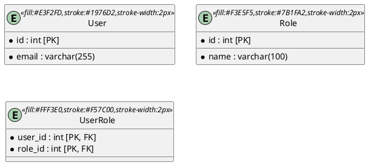
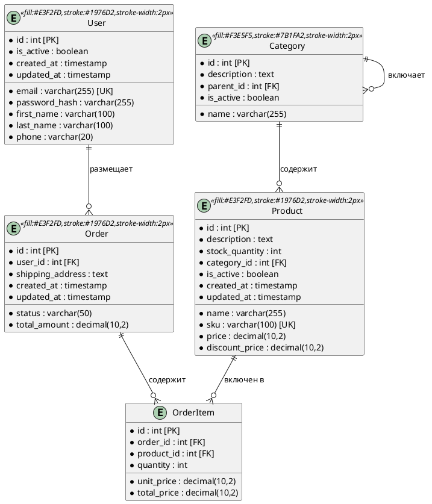
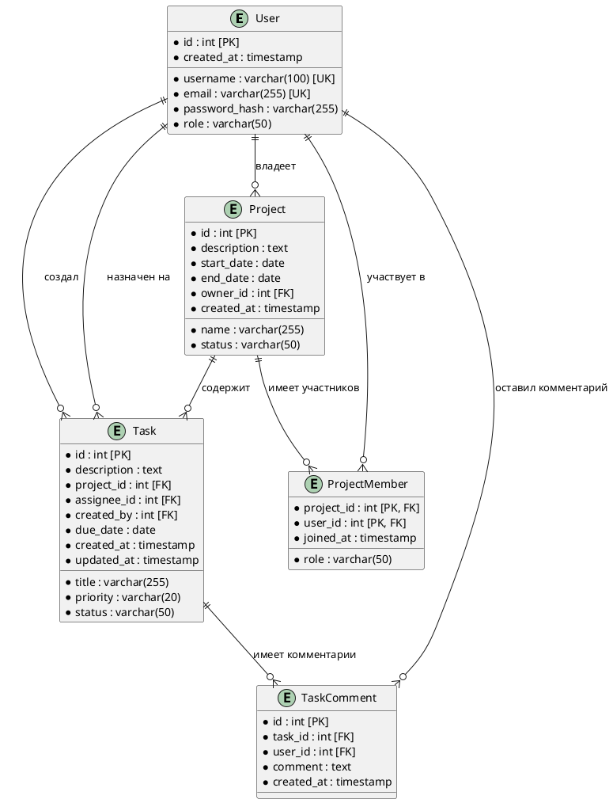
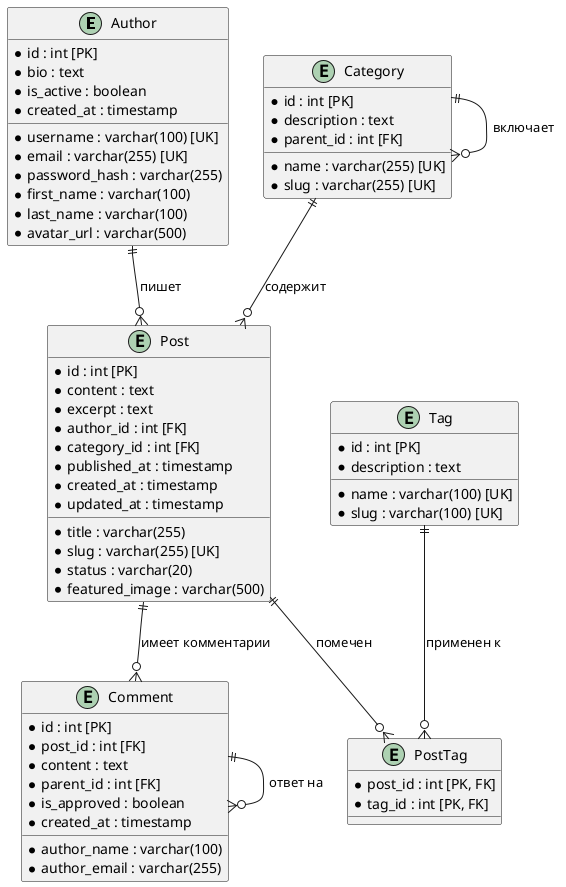

# Инструкция для ИИ агента: Формирование ERD диаграмм с помощью PlantUML

## Содержание
1. [Введение](#введение)
2. [Основы синтаксиса PlantUML для ERD](#основы-синтаксиса-plantuml-для-erd)
3. [Базовые элементы ERD](#базовые-элементы-erd)
4. [Типы связей](#типы-связей)
5. [Расширенные возможности](#расширенные-возможности)
6. [Лучшие практики](#лучшие-практики)
7. [Примеры сценариев](#примеры-сценариев)
8. [Часто встречающиеся ошибки](#часто-встречающиеся-ошибки)

## Введение

ERD (Entity-Relationship Diagram) диаграммы - это графические представления структуры базы данных, показывающие сущности, их атрибуты и связи между ними. PlantUML предоставляет мощный и гибкий синтаксис для создания профессиональных ERD диаграмм.

### Основная структура файла PlantUML для ERD:

```plantuml
@startuml
!define ENTITY_STYLE fill:#E1F5FE,stroke:#01579B,stroke-width:2px
!define RELATIONSHIP_STYLE fill:#FFF3E0,stroke:#E65100,stroke-width:2px

' Здесь размещается содержимое диаграммы
@enduml
```

## Основы синтаксиса PlantUML для ERD

### Базовая структура сущности:

```plantuml
entity "Название_сущности" as alias {
  * поле1 : тип [PK]
  --
  * поле2 : тип [NOT NULL]
  поле3 : тип [NULL]
  --
  поле4 : тип [FK]
}
```

### Обозначения:
- `*` - обязательное поле (NOT NULL)
- `--` - разделитель секций
- `[PK]` - первичный ключ
- `[FK]` - внешний ключ
- `[UK]` - уникальный ключ

## Базовые элементы ERD

### 1. Создание сущностей

#### Простая сущность:
```plantuml
entity User {
  * id : int [PK]
  * email : varchar(255) [UK]
  * password_hash : varchar(255)
  first_name : varchar(100)
  last_name : varchar(100)
  created_at : timestamp
  updated_at : timestamp
}
```

#### Сущность с группировкой полей:
```plantuml
entity Product {
  ' Основная информация
  * id : int [PK]
  * name : varchar(255)
  * description : text
  --
  ' Ценовая информация
  * price : decimal(10,2)
  discount_price : decimal(10,2)
  --
  ' Системные поля
  * created_at : timestamp
  * updated_at : timestamp
  deleted_at : timestamp
}
```

### 2. Создание связей

#### Основные типы связей:
- `||--||` - один к одному (1:1)
- `||--o{` - один ко многим (1:N)
- `}o--o{` - многие ко многим (M:N)
- `||--o|` - один к нулю или одному (1:0..1)

#### Примеры связей:
```plantuml
User ||--o{ Order : "размещает"
Product }o--o{ Order : "содержит"
Order ||--|| Payment : "имеет"
```

## Типы связей

### 1. Один к одному (1:1)
```plantuml
entity User {
  * id : int [PK]
  * email : varchar(255)
}

entity UserProfile {
  * user_id : int [PK, FK]
  * first_name : varchar(100)
  * last_name : varchar(100)
}

User ||--|| UserProfile : "имеет профиль"
```

### 2. Один ко многим (1:N)
```plantuml
entity Category {
  * id : int [PK]
  * name : varchar(255)
}

entity Product {
  * id : int [PK]
  * name : varchar(255)
  * category_id : int [FK]
}

Category ||--o{ Product : "содержит"
```

### 3. Многие ко многим (M:N)
```plantuml
entity Product {
  * id : int [PK]
  * name : varchar(255)
}

entity Tag {
  * id : int [PK]
  * name : varchar(255)
}

entity ProductTag {
  * product_id : int [PK, FK]
  * tag_id : int [PK, FK]
}

Product ||--o{ ProductTag
Tag ||--o{ ProductTag
```

## Расширенные возможности

### 1. Стилизация и цвета



### 2. Группировка сущностей

```plantuml
package "Пользователи" {
  entity User
  entity UserProfile
  entity UserRole
}

package "Товары" {
  entity Product
  entity Category
  entity ProductTag
}

package "Заказы" {
  entity Order
  entity OrderItem
  entity Payment
}
```

### 3. Добавление заметок и комментариев

```plantuml
entity User {
  * id : int [PK]
  * email : varchar(255) [UK]
}

note right of User : Основная сущность\nдля аутентификации\nпользователей

note on link : Один пользователь\nможет иметь\nмного заказов
User ||--o{ Order
```

## Лучшие практики

### 1. Именование сущностей и полей

**Правильно:**
```plantuml
entity User {
  * id : int [PK]
  * email : varchar(255)
  * first_name : varchar(100)
  * created_at : timestamp
}
```

**Избегать:**
```plantuml
entity user {
  * ID : int [PK]
  * Email : varchar(255)
  * firstName : varchar(100)
  * createdAt : timestamp
}
```

### 2. Структурирование полей

```plantuml
entity Product {
  ' Первичный ключ
  * id : int [PK]
  --
  ' Основная информация
  * name : varchar(255)
  * description : text
  * sku : varchar(100) [UK]
  --
  ' Ценовая информация
  * price : decimal(10,2)
  discount_price : decimal(10,2)
  --
  ' Связи
  * category_id : int [FK]
  * brand_id : int [FK]
  --
  ' Системные поля
  * is_active : boolean
  * created_at : timestamp
  * updated_at : timestamp
}
```

### 3. Использование псевдонимов для длинных названий

```plantuml
entity "Пользователь системы" as User {
  * id : int [PK]
  * email : varchar(255)
}

entity "Заказ пользователя" as Order {
  * id : int [PK]
  * user_id : int [FK]
}

User ||--o{ Order : "размещает"
```

## Примеры сценариев

### 1. Система электронной коммерции



### 2. Система управления задачами



### 3. Система блога



## Часто встречающиеся ошибки

### 1. Неправильное обозначение связей

**Неправильно:**
```plantuml
User --> Order
```

**Правильно:**
```plantuml
User ||--o{ Order : "размещает"
```

### 2. Отсутствие типов данных

**Неправильно:**
```plantuml
entity User {
  id [PK]
  email
  name
}
```

**Правильно:**
```plantuml
entity User {
  * id : int [PK]
  * email : varchar(255)
  * name : varchar(100)
}
```

### 3. Неправильная группировка полей

**Неправильно:**
```plantuml
entity User {
  * id : int [PK]
  * email : varchar(255)
  created_at : timestamp
  * password_hash : varchar(255)
  updated_at : timestamp
}
```

**Правильно:**
```plantuml
entity User {
  * id : int [PK]
  --
  * email : varchar(255)
  * password_hash : varchar(255)
  --
  created_at : timestamp
  updated_at : timestamp
}
```

### 4. Отсутствие подписей к связям

**Неправильно:**
```plantuml
User ||--o{ Order
```

**Правильно:**
```plantuml
User ||--o{ Order : "размещает"
```

## Заключение

При создании ERD диаграмм с помощью PlantUML следуй этим принципам:

1. **Ясность**: Используй понятные названия сущностей и полей
2. **Структурированность**: Группируй связанные поля разделителями
3. **Полнота**: Указывай типы данных, ограничения и связи
4. **Консистентность**: Используй единый стиль именования
5. **Документированность**: Добавляй комментарии и заметки для сложных элементов

Этот подход поможет создавать профессиональные и понятные ERD диаграммы, которые будут полезны как для разработчиков, так и для аналитиков. 