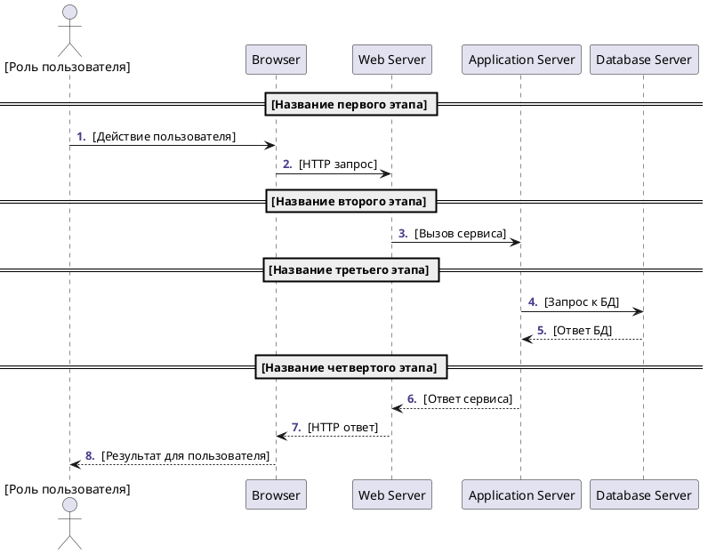
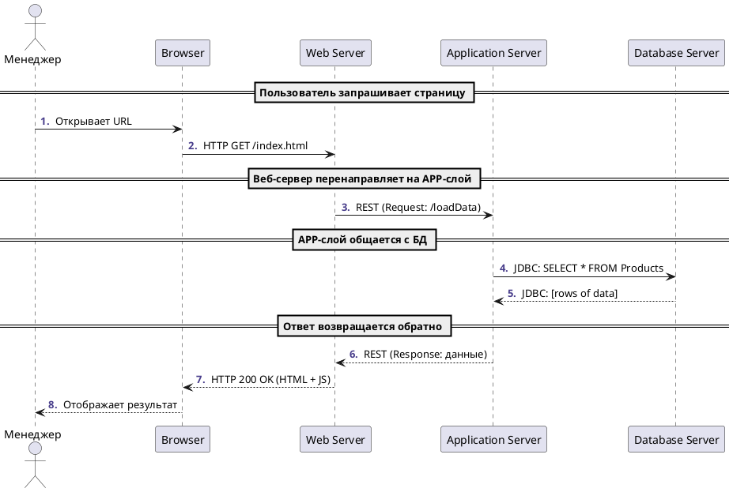

# Инструкции по написанию Sequence диаграмм для ИИ агента

## Общие принципы

При создании Sequence диаграмм следуй стандартному синтаксису PlantUML и структуре взаимодействий, основанной на анализе шаблона.

## Необходимые артефакты для создания Sequence диаграммы

### 1. Обязательные артефакты
- **User Story (US)** - для понимания пользовательского сценария и бизнес-логики
- **Архитектурная/Компонентная диаграмма** - для понимания участников и их взаимосвязей
- **Use Case** - для детального описания потока взаимодействий

### 2. Дополнительные артефакты
- **Техническая спецификация** - для понимания протоколов и технологий
- **API документация** - для корректного описания вызовов
- **Диаграмма развертывания** - для понимания физического расположения компонентов

## Структура Sequence диаграммы

### 1. Заголовок и настройки
```plantuml
@startuml
autonumber "<b><color:DarkSlateBlue>.</color></b> " 
```

### 2. Определение участников
```plantuml
actor User as "Роль пользователя"
participant Browser as "Browser"
participant "Web Server" as WebServer
participant "Application Server" as AppServer
participant "Database Server" as DBServer
```

### 3. Группировка этапов
```plantuml
== Название этапа ==
```

### 4. Взаимодействия
```plantuml
User -> Browser : Описание действия
Browser -> WebServer : Протокол и детали
```

### 5. Завершение
```plantuml
@enduml
```

## Типы участников

### Actor (Актор)
- Используй для **внешних пользователей** системы
- Формат: `actor User as "Роль"`
- Примеры ролей: Менеджер, Администратор, Клиент, Аналитик

### Participant (Участник)
- Используй для **системных компонентов**
- Формат: `participant "Component Name" as Alias`
- Примеры: Browser, Web Server, Application Server, Database, API Gateway

## Протоколы и технологии взаимодействий

### HTTP взаимодействия
```plantuml
Browser -> WebServer : HTTP GET /endpoint
WebServer --> Browser : HTTP 200 OK (response)
```

### REST API вызовы
```plantuml
WebServer -> AppServer : REST (Request: /api/getData)
AppServer --> WebServer : REST (Response: JSON data)
```

### База данных
```plantuml
AppServer -> DBServer : JDBC: SELECT * FROM table
DBServer --> AppServer : JDBC: [результат запроса]
```

### Другие протоколы
- **gRPC**: `Service -> Service : gRPC: methodName`
- **Message Queue**: `Producer -> Queue : MQ: publish message`
- **WebSocket**: `Client -> Server : WebSocket: connection`

## Шаблон базовой Sequence диаграммы



## Правила именования и описания

### Участники
- **Роли пользователей**: используй конкретные бизнес-роли (Менеджер, Аналитик, Администратор)
- **Системные компоненты**: используй архитектурные названия (Web Server, API Gateway, Database)

### Действия и сообщения
- **Действия пользователя**: описывай в бизнес-терминах ("Запрашивает отчет", "Создает заказ")
- **Технические вызовы**: включай протокол и детали ("HTTP GET /api/orders", "JDBC: SELECT")
- **Ответы**: указывай статус и тип данных ("HTTP 200 OK (JSON)", "ResultSet")

## Группировка этапов

### Стандартные группы
1. **Инициация**: "Пользователь инициирует действие"
2. **Валидация**: "Проверка данных и прав доступа"
3. **Обработка**: "Бизнес-логика и вычисления"
4. **Сохранение**: "Работа с базой данных"
5. **Ответ**: "Возврат результата пользователю"

### Примеры названий групп
- "== Аутентификация пользователя =="
- "== Загрузка данных из БД =="
- "== Обработка бизнес-логики =="
- "== Формирование ответа =="

## Типы стрелок и их использование

### Синхронные вызовы
```plantuml
A -> B : Синхронный запрос
B --> A : Синхронный ответ
```

### Асинхронные вызовы
```plantuml
A ->> B : Асинхронный запрос
B -->> A : Асинхронный ответ
```

### Самовызовы
```plantuml
A -> A : Внутренняя обработка
```

## Обработка ошибок

### Альтернативные потоки
```plantuml
alt Успешный сценарий
    AppServer -> DBServer : SELECT query
    DBServer --> AppServer : Data returned
else Ошибка базы данных
    AppServer -> DBServer : SELECT query
    DBServer --> AppServer : Error: Connection timeout
    AppServer --> WebServer : HTTP 500 Internal Error
end
```

### Условные блоки
```plantuml
opt Если пользователь авторизован
    WebServer -> AppServer : GET /protected-resource
end
```

## Пример анализа User Story для Sequence диаграммы

### Исходная User Story
```
US-006: Просмотр списка заказов
Как менеджер по продажам,
я хочу просматривать список всех заказов за текущий месяц,
чтобы анализировать продажи и планировать работу с клиентами.
```

### Извлеченные участники
- **Actor**: Менеджер по продажам
- **Participants**: Browser, Web Server, Application Server, Database Server

### Извлеченные этапы
1. Пользователь запрашивает страницу заказов
2. Система проверяет права доступа
3. Загрузка данных из базы
4. Отображение результата

## Контрольный чек-лист

Перед финализацией Sequence диаграммы проверь:

- [ ] Есть все необходимые участники из архитектурной диаграммы
- [ ] Роль пользователя соответствует User Story
- [ ] Логический поток соответствует Use Case
- [ ] Указаны корректные протоколы (HTTP, REST, JDBC и т.д.)
- [ ] Есть группировка по логическим этапам
- [ ] Синхронные/асинхронные взаимодействия корректно обозначены
- [ ] Обработаны основные сценарии ошибок
- [ ] Диаграмма начинается с @startuml и заканчивается @enduml

## Интеграция с другими артефактами

### Связь с User Story
- Актор диаграммы = роль из US
- Основной поток = описание действий из US
- Результат = ожидаемая выгода из US

### Связь с компонентной диаграммой
- Участники sequence = компоненты из архитектуры
- Взаимодействия = связи между компонентами
- Протоколы = технологии интеграции

### Связь с Use Case
- Основной поток UC = главная последовательность
- Альтернативные потоки UC = alt/opt блоки
- Исключения UC = error handling

## Рекомендации по стилю

1. **Краткость**: сообщения не должны быть слишком длинными
2. **Ясность**: используй понятную терминологию
3. **Последовательность**: соблюдай логический порядок вызовов
4. **Группировка**: объединяй связанные действия в блоки
5. **Детализация**: включай достаточно деталей для понимания, но не перегружай

## Пример Sequence диаграммы из шаблона

Вот эталонный пример правильно оформленной диаграммы:



## Анализ примера

Этот пример демонстрирует:

1. **Правильное использование autonumber** - для автоматической нумерации шагов
2. **Четкое разделение ролей** - actor для пользователя, participant для системных компонентов
3. **Логическую группировку** - каждый этап имеет понятное название
4. **Конкретные протоколы** - HTTP, REST, JDBC с деталями запросов
5. **Правильное направление стрелок** - синхронные вызовы и ответы
6. **Понятные описания** - каждое взаимодействие четко описано

Используй этот пример как эталон при создании собственных Sequence диаграмм. 