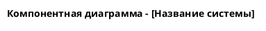
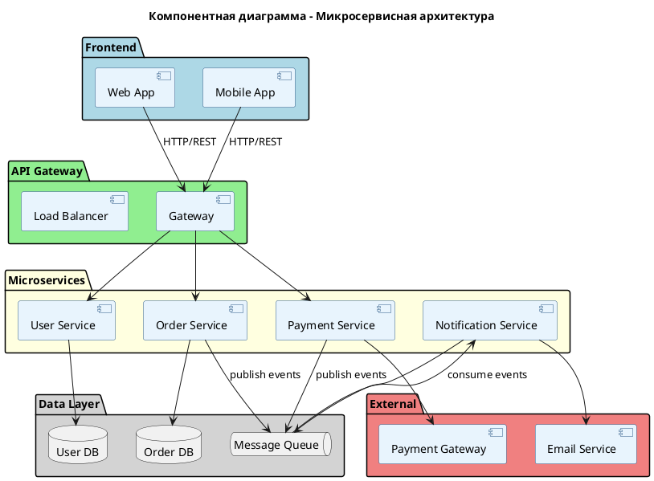
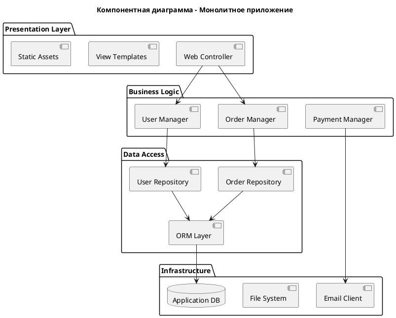

# Инструкция по созданию компонентных диаграмм в PlantUML

## ОБЩИЕ ПРИНЦИПЫ

### Что такое компонентная диаграмма
Компонентная диаграмма показывает архитектуру системы на уровне компонентов, их зависимости, интерфейсы и взаимодействия. Это структурная диаграмма UML, которая помогает понять:
- Как система разделена на модули
- Какие зависимости существуют между компонентами
- Какие интерфейсы предоставляют и используют компоненты
- Как данные и управление передаются между частями системы

### Когда использовать компонентную диаграмму
- При проектировании архитектуры системы
- Для документирования существующей архитектуры
- При планировании рефакторинга или модернизации
- Для анализа зависимостей между модулями
- При интеграции с внешними системами

## ОБЯЗАТЕЛЬНАЯ СТРУКТУРА ФАЙЛА

### 1. Заголовок файла


### 2. Стили и темы (ОБЯЗАТЕЛЬНО)
```plantuml
' Настройка стилей для компонентов
skinparam component {
    BackgroundColor #E8F4FD
    BorderColor #2E5A87
    FontSize 12
    FontColor Black
}

' Настройка стилей для интерфейсов
skinparam interface {
    BackgroundColor #667EEA
    BorderColor #2E5A87
    FontColor White
    FontSize 10
}

' Настройка стилей для связей
skinparam arrow {
    Color #2E5A87
    FontSize 10
}

' Настройка стилей для пакетов/групп
skinparam package {
    BackgroundColor #F0F8FF
    BorderColor #4682B4
    FontSize 14
}
```

### 3. Завершение файла
```plantuml
@enduml
```

## ЭЛЕМЕНТЫ КОМПОНЕНТНОЙ ДИАГРАММЫ

### 1. КОМПОНЕНТЫ

#### Основной синтаксис
```plantuml
component "Название компонента" as alias
component [Краткое название] as alias
[Компонент] as alias
```

#### Примеры компонентов по типам
```plantuml
' Frontend компоненты
component "Web Frontend" as web_ui
component "Mobile App" as mobile_app
component "Admin Panel" as admin_ui

' Backend компоненты
component "API Gateway" as api_gateway
component "Authentication Service" as auth_service
component "User Service" as user_service
component "Payment Service" as payment_service
component "Notification Service" as notification_service

' Инфраструктурные компоненты
component "Load Balancer" as load_balancer
component "Message Queue" as message_queue
component "Cache Redis" as redis_cache
component "File Storage" as file_storage

' Базы данных
component "User Database" as user_db
component "Transaction Database" as transaction_db
component "Analytics Database" as analytics_db

' Внешние системы
component "Payment Gateway" as external_payment
component "SMS Provider" as sms_provider
component "Email Service" as email_service
```

### 2. ИНТЕРФЕЙСЫ

#### Синтаксис интерфейсов
```plantuml
' Определение интерфейса
interface "Название интерфейса" as interface_alias

' Интерфейс как порт
() "HTTP REST API" as http_api
() "WebSocket" as websocket
() "GraphQL" as graphql_api
() "gRPC" as grpc_api
```

#### Типы интерфейсов
```plantuml
' HTTP интерфейсы
() "REST API" as rest_api
() "GraphQL API" as graphql
() "WebSocket API" as ws_api

' Протоколы обмена данными
() "gRPC" as grpc
() "Message Queue" as mq_interface
() "Database Connection" as db_interface

' Файловые интерфейсы
() "File System" as fs_interface
() "S3 Compatible" as s3_interface

' Внешние интерфейсы
() "Payment API" as payment_api
() "SMS API" as sms_api
() "Email SMTP" as email_api
```

### 3. СВЯЗИ И ЗАВИСИМОСТИ

#### Типы связей
```plantuml
' Простая зависимость (uses)
ComponentA --> ComponentB

' Зависимость через интерфейс
ComponentA --> InterfaceX
InterfaceX --> ComponentB

' Предоставление интерфейса
ComponentA --( InterfaceY
InterfaceY )-- ComponentB

' Реализация интерфейса
ComponentA ..|> Interface

' Композиция/агрегация
ComponentA *-- ComponentB
ComponentA o-- ComponentC
```

#### Подписи к связям
```plantuml
ComponentA --> ComponentB : uses/calls
ComponentA --> ComponentB : HTTP/REST
ComponentA --> ComponentB : async/sync
ComponentA --> ComponentB : TCP/UDP
ComponentA --> ComponentB : 1..* / 0..1
```

## ГРУППИРОВКА И ОРГАНИЗАЦИЯ

### 1. Пакеты и группы
```plantuml
package "Frontend Layer" {
    component [Web UI] as web
    component [Mobile App] as mobile
}

package "API Layer" {
    component [API Gateway] as gateway
    component [Load Balancer] as lb
}

package "Business Logic Layer" {
    component [User Service] as users
    component [Payment Service] as payments
    component [Order Service] as orders
}

package "Data Layer" {
    component [User DB] as user_db
    component [Order DB] as order_db
    component [Cache] as cache
}

package "External Systems" {
    component [Payment Gateway] as ext_payment
    component [Email Service] as ext_email
}
```

### 2. Слои архитектуры
```plantuml
!define LAYER rectangle

LAYER "Presentation Layer" {
    [Web Frontend]
    [Mobile App]
    [Admin Panel]
}

LAYER "API Gateway Layer" {
    [API Gateway]
    [Load Balancer]
    [Rate Limiter]
}

LAYER "Service Layer" {
    [Auth Service]
    [User Service]
    [Business Service]
}

LAYER "Data Layer" {
    [Primary DB]
    [Cache]
    [File Storage]
}
```

## СПЕЦИАЛИЗИРОВАННЫЕ ЭЛЕМЕНТЫ

### 1. Типы компонентов с иконками
```plantuml
' База данных
database "User Database" as user_db
database "Transaction DB" as tx_db

' Файловое хранилище
folder "File Storage" as files
folder "Log Storage" as logs

' Облачные сервисы
cloud "AWS S3" as s3
cloud "CDN" as cdn

' Очереди сообщений
queue "Message Queue" as mq
queue "Event Bus" as events

' Веб-сервисы
node "Web Server" as web_server
node "App Server" as app_server
```

### 2. Стереотипы компонентов
```plantuml
component "User Service" <<microservice>>
component "Payment Gateway" <<external>>
component "User Database" <<database>>
component "Authentication" <<security>>
component "File Upload" <<utility>>
component "Email Sender" <<integration>>
```

## ЛУЧШИЕ ПРАКТИКИ

### 1. Именование
- **Компоненты**: используйте понятные бизнес-названия
- **Интерфейсы**: указывайте протокол/тип (REST API, gRPC, etc.)
- **Алиасы**: короткие, понятные, в snake_case
- **Связи**: подписывайте важные связи

### 2. Группировка
- Группируйте по архитектурным слоям
- Выделяйте внешние системы отдельно
- Используйте цвета для разных типов компонентов
- Не перегружайте диаграмму - разбивайте на несколько

### 3. Уровни детализации
- **Высокий уровень**: основные модули системы
- **Средний уровень**: сервисы и их интерфейсы
- **Детальный уровень**: включает внутренние компоненты

### 4. Цветовое кодирование
```plantuml
' Цвета по типам компонентов
component "Frontend" #lightblue
component "Backend Service" #lightgreen
component "Database" #lightyellow
component "External System" #lightcoral
component "Infrastructure" #lightgray
```

## ПРИМЕРЫ ГОТОВЫХ ШАБЛОНОВ

### 1. Микросервисная архитектура


### 2. Монолитная архитектура


## АНТИ-ПАТТЕРНЫ (ЧЕГО ИЗБЕГАТЬ)

### 1. НЕ делайте
- Не перегружайте диаграмму деталями
- Не показывайте все возможные связи
- Не используйте слишком техничные названия
- Не игнорируйте группировку компонентов
- Не забывайте про внешние зависимости

### 2. Плохие примеры
```plantuml
' ПЛОХО - слишком техничные названия
component "com.company.service.UserServiceImpl" 

' ПЛОХО - отсутствие группировки
component A
component B  
component C
A --> B
B --> C

' ПЛОХО - перегрузка связями
ComponentA --> ComponentB
ComponentA --> ComponentC  
ComponentA --> ComponentD
ComponentB --> ComponentC
ComponentB --> ComponentD
ComponentC --> ComponentD
```

### 3. Хорошие примеры
```plantuml
' ХОРОШО - понятные бизнес-названия
component "User Management Service" as user_service

' ХОРОШО - четкая группировка
package "Business Services" {
    component "User Service" as users
    component "Order Service" as orders
}

' ХОРОШО - основные связи с подписями
users --> user_db : stores/retrieves
orders --> users : validates user
```

## ПРОЦЕСС СОЗДАНИЯ ДИАГРАММЫ

### Шаг 1: Анализ требований
1. Определите границы системы
2. Выявите основные функциональные блоки
3. Определите внешние зависимости
4. Выберите уровень детализации

### Шаг 2: Проектирование
1. Создайте список компонентов
2. Определите их роли и ответственности
3. Выявите интерфейсы и связи
4. Спланируйте группировку

### Шаг 3: Создание диаграммы
1. Начните с заголовка и стилей
2. Определите пакеты/группы
3. Добавьте компоненты
4. Добавьте интерфейсы и связи
5. Добавьте аннотации и примечания

### Шаг 4: Проверка и улучшение
1. Проверьте читаемость
2. Убедитесь в полноте информации
3. Оптимизируйте расположение элементов
4. Добавьте пояснения при необходимости

## ГОТОВЫЕ ФРАГМЕНТЫ КОДА

### Веб-приложение
```plantuml
package "Web Application" {
    [Frontend] as fe
    [Backend API] as api
    [Authentication] as auth
    database "Database" as db
    
    fe --> api : HTTP/REST
    api --> auth : validates
    api --> db : CRUD operations
}
```

### Микросервис
```plantuml
component "Service Name" as service {
    [Controller] as ctrl
    [Business Logic] as logic
    [Repository] as repo
}

() "REST API" as api
database "Service DB" as db

api --> ctrl
ctrl --> logic
logic --> repo
repo --> db
```

### Интеграция с внешней системой
```plantuml
[Internal Service] as internal
() "External API" as ext_api
[External System] as external

internal --> ext_api : HTTP/REST
ext_api --> external
```

Эта инструкция должна помочь ИИ агенту создавать качественные и структурированные компонентные диаграммы в PlantUML для любых типов систем. 