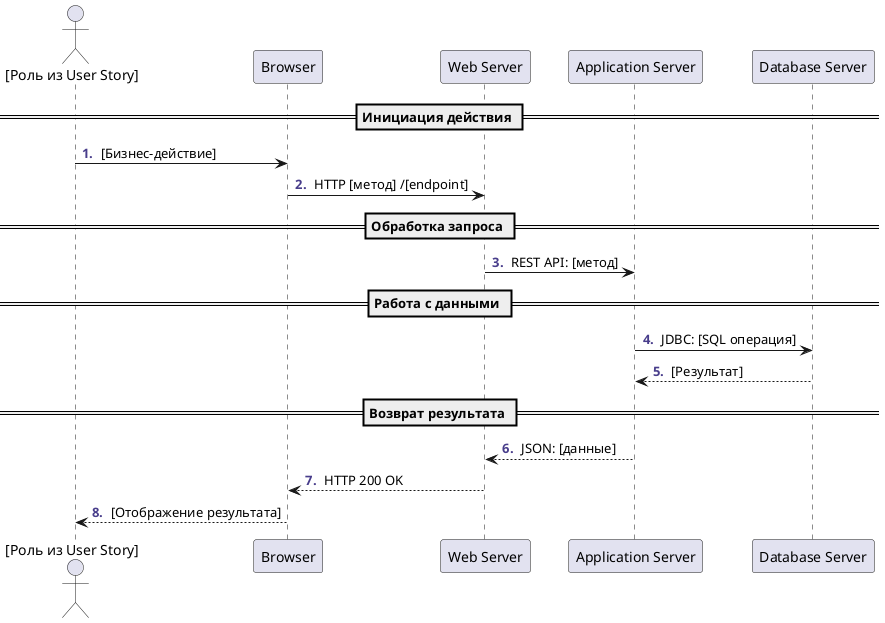

# Инструкции по созданию Sequence диаграмм для ИИ агента

## Содержание
1. [Основы и требования](#основы-и-требования)
2. [Структура диаграммы](#структура-диаграммы)
3. [Метрики качества](#метрики-качества)
4. [Валидационные правила](#валидационные-правила)
5. [Базовый шаблон](#базовый-шаблон)
6. [Типы взаимодействий](#типы-взаимодействий)
7. [Интеграция с артефактами](#интеграция-с-артефактами)
8. [Чек-лист качества](#чек-лист-качества)

---

## Основы и требования

### Обязательные входные артефакты:
- **User Story** - для понимания бизнес-сценария
- **Use Case** - для детального потока взаимодействий
- **Архитектурная диаграмма** - для участников и связей

### Дополнительные артефакты:
- API документация, техническая спецификация, диаграмма развертывания

---

## Структура диаграммы

### 1. Заголовок и настройки
```plantuml
@startuml
autonumber "<b><color:DarkSlateBlue>.</color></b> " 
```

### 2. Участники (строгая типизация)
```plantuml
actor User as "Роль из User Story"
participant Browser as "Browser"
participant "Web Server" as WebServer
participant "Application Server" as AppServer
participant "Database Server" as DBServer
```

### 3. Группировка этапов
```plantuml
== Название логического этапа ==
```

### 4. Взаимодействия с протоколами
```plantuml
User -> Browser : Бизнес-действие
Browser -> WebServer : HTTP GET/POST /endpoint
WebServer -> AppServer : REST API: метод
AppServer -> DBServer : JDBC: SELECT/INSERT
```

---

## Метрики качества

### Целевые показатели:
- **Покрытие участников**: 100% из архитектурной диаграммы
- **Логическая группировка**: 3-7 этапов с понятными названиями
- **Детализация протоколов**: 90% взаимодействий с указанием технологии
- **Обработка ошибок**: минимум 2 альтернативных сценария

### Система оценки:
- **Отличное качество**: ≥90% соответствие метрикам
- **Хорошее качество**: 70-89% соответствие метрикам
- **Требует доработки**: <70% соответствие метрикам

---

## Валидационные правила

### Автоматические проверки:
```
✓ Начинается с @startuml, заканчивается @enduml
✓ Роль актора соответствует User Story
✓ Участники присутствуют в архитектурной диаграмме
✓ Каждый этап имеет название в формате "== Название =="
✓ Протоколы указаны для технических взаимодействий
✓ Синхронные/асинхронные стрелки используются корректно
✓ Есть минимум 1 альтернативный поток (alt/opt/loop)
```

---

## Базовый шаблон



---

## Типы взаимодействий

### Протоколы и синтаксис:
| Тип | Синтаксис | Пример |
|-----|-----------|--------|
| **HTTP** | `HTTP [метод] /endpoint` | `HTTP GET /api/users` |
| **REST API** | `REST API: [операция]` | `REST API: getUserData` |
| **База данных** | `JDBC: [SQL]` | `JDBC: SELECT * FROM users` |
| **Message Queue** | `MQ: [операция]` | `MQ: publish userCreated` |
| **gRPC** | `gRPC: [метод]` | `gRPC: GetUserProfile` |

### Типы стрелок:
- `->` и `-->` - синхронные вызовы/ответы
- `->>` и `-->>` - асинхронные вызовы/ответы
- `->` на себя - внутренняя обработка

### Управляющие конструкции:
```plantuml
alt Успешный сценарий
    // основной поток
else Ошибка
    // обработка ошибки
end

opt Условное выполнение
    // опциональные действия
end

loop Повторение
    // циклические действия
end
```

---

## Интеграция с артефактами

### Связь с User Story:
- **Актор диаграммы** = роль из US
- **Основной поток** = описание действий из US
- **Результат** = ожидаемая выгода из US

### Связь с Use Case:
- **Основной сценарий UC** = главная последовательность
- **Альтернативные потоки UC** = alt/opt блоки в диаграмме
- **Исключения UC** = error handling блоки

### Связь с архитектурой:
- **Участники sequence** = компоненты из архитектуры
- **Взаимодействия** = связи между компонентами
- **Протоколы** = технологии интеграции

---

## Стандартные этапы и названия

### Типовые группы:
1. **Инициация**: "Пользователь инициирует действие"
2. **Аутентификация**: "Проверка прав доступа"
3. **Валидация**: "Проверка входных данных"
4. **Обработка**: "Бизнес-логика и вычисления"
5. **Сохранение**: "Работа с базой данных"
6. **Уведомления**: "Отправка сообщений"
7. **Ответ**: "Возврат результата пользователю"

### Примеры конкретных названий:
- "== Загрузка списка заказов =="
- "== Проверка корректности платежных данных =="
- "== Формирование отчета по продажам =="

---

## Обработка ошибок

### Обязательные сценарии ошибок:
```plantuml
alt Успешное выполнение
    AppServer -> DBServer : SELECT query
    DBServer --> AppServer : Data returned
else Ошибка подключения к БД
    AppServer -> DBServer : SELECT query
    DBServer --> AppServer : Error: Connection timeout
    AppServer --> WebServer : HTTP 500 Internal Error
    WebServer --> Browser : Страница ошибки
else Ошибка валидации данных
    AppServer -> AppServer : Validate input
    AppServer --> WebServer : HTTP 400 Bad Request
    WebServer --> Browser : Сообщение об ошибке
end
```

---

## Чек-лист качества

### Структурная проверка:
- [ ] ✅ Файл начинается с `@startuml` и заканчивается `@enduml`
- [ ] ✅ Используется autonumber для нумерации шагов
- [ ] ✅ Актор соответствует роли из User Story
- [ ] ✅ Все участники есть в архитектурной диаграмме

### Логическая проверка:
- [ ] ✅ 3-7 логических этапов с понятными названиями
- [ ] ✅ Последовательность шагов соответствует Use Case
- [ ] ✅ Есть альтернативные потоки (alt/opt/loop)
- [ ] ✅ Обработка минимум 2 типов ошибок

### Техническая проверка:
- [ ] ✅ Протоколы указаны для всех технических вызовов
- [ ] ✅ HTTP методы и endpoints конкретизированы
- [ ] ✅ SQL операции детализированы
- [ ] ✅ Синхронные/асинхронные вызовы корректны

### Интеграционная проверка:
- [ ] 🔗 Соответствие основному сценарию Use Case
- [ ] 🔗 Покрытие всех акторов из архитектуры
- [ ] 🔗 Технические детали соответствуют API спецификации

**Цель**: Создавать Sequence диаграммы, готовые для технической реализации и тестирования.

---

## Рекомендации по стилю

### Именование:
- **Акторы**: конкретные бизнес-роли
- **Участники**: архитектурные компоненты
- **Сообщения**: бизнес-термины для пользователей, технические для систем

### Детализация:
- **Краткость**: сообщения до 50 символов
- **Ясность**: понятная терминология
- **Последовательность**: логический порядок вызовов
- **Группировка**: объединение связанных действий

### Примеры качественных описаний:
✅ "HTTP POST /api/orders - создание заказа"  
✅ "JDBC: INSERT INTO orders (user_id, total)"  
✅ "Отображение страницы подтверждения заказа"  

❌ "Делает запрос"  
❌ "Возвращает данные"  
❌ "Система обрабатывает" 